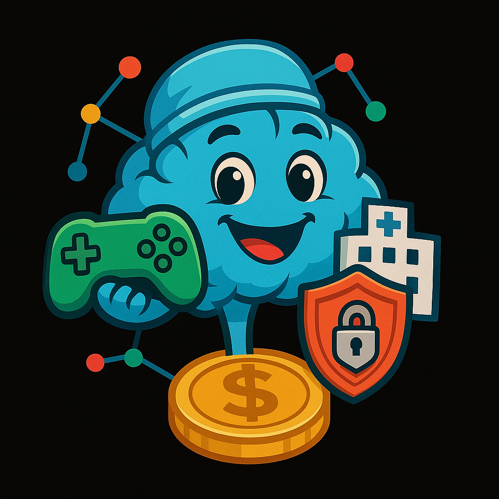

# 🧠 NeuralSync Protocol

<div align="center">
  
</div>

> Federated Learning Meets Gaming - Democratizing Medical AI Through Collaborative Intelligence

[](https://opensource.org/licenses/NeuralSyncFL)
[](https://neuralsync.health)
[](https://twitter.com/NeuralSyncFL)
[](https://discord.gg/neuralsync)

<br>

<div align="center">
  <h3>🏥 Privacy-Preserving Healthcare • 🎮 Learn-to-Earn • 🔬 Real Medical Impact • 🎨 510 Hospital NFTs</h3>
</div>

<br>

## 📋 Table of Contents

- [Overview](#overview)
- [Core Concepts](#core-concepts)
- [Game Ecosystem](#game-ecosystem)
- [Technology Stack](#technology-stack)
- [Getting Started](#getting-started)
- [Smart Contracts](#smart-contracts)
- [Tokenomics](#tokenomics)
- [Hospital NFT Collection](#hospital-nft-collection)
- [Federated Learning Framework](#federated-learning-framework)
- [Privacy & Security](#privacy-security)
- [Medical Partnerships](#medical-partnerships)
- [Roadmap](#roadmap)
- [Contributing](#contributing)
- [License](#license)

## 🔬 Overview

NeuralSync Protocol is a revolutionary serious gaming platform that transforms the complex world of federated learning into an engaging, educational experience. By gamifying privacy-preserving machine learning, we're creating a new generation of healthcare data scientists while contributing to real medical breakthroughs.

### Why NeuralSync?

- **Learn by Doing**: Master federated learning concepts through interactive gameplay
- **Real Impact**: Contribute to actual medical research while gaming
- **Privacy First**: Experience cutting-edge privacy preservation techniques
- **Earn Rewards**: Get $SYNAPSE tokens for learning and contributing
- **Build Networks**: Connect with healthcare institutions worldwide

## 🎯 Core Concepts

### Federated Learning Simplified

Our platform teaches these complex concepts through gaming:

1. **Distributed Training**: Train AI models without sharing raw patient data
2. **Privacy Preservation**: Implement differential privacy, homomorphic encryption
3. **Collaborative Intelligence**: Aggregate knowledge from multiple hospitals
4. **Byzantine Tolerance**: Handle unreliable or malicious participants
5. **Model Convergence**: Achieve global optimization through local training

### Educational Framework

```
Player Journey:
Novice → Practitioner → Specialist → Expert → Master

Each level unlocks:
- New privacy techniques
- Advanced algorithms
- Real medical datasets
- Research opportunities
```

## 🎮 Game Ecosystem

### 1. **Neural Network Builder** 🏗️
**Status**: LIVE

<div align="center">
  
</div>

- **Genre**: Management Simulation
- **Learn**: Model architecture, training cycles, gradient descent
- **Gameplay**: Build and manage a hospital AI department
- **Rewards**: 
  - Daily training: 50 $SYNAPSE
  - Model accuracy bonus: up to 200 $SYNAPSE
  - Perfect privacy round: 500 $SYNAPSE

### 2. **Privacy Guardian** 🛡️
**Status**: Beta Testing

- **Genre**: Tower Defense
- **Learn**: Differential privacy, secure aggregation, SMPC
- **Gameplay**: Defend patient data from various attack vectors
- **Special Features**:
  - 50 unique attack patterns
  - 10 privacy techniques to master
  - Multiplayer co-op mode

### 3. **Consensus Quest** 🤝
**Status**: In Development

- **Genre**: Cooperative Puzzle
- **Learn**: Byzantine fault tolerance, consensus algorithms
- **Gameplay**: Coordinate with other players to aggregate models
- **Innovation**: Real federated learning rounds between players

### 4. **Data Drift Detective** 🔍
**Status**: Coming Q2 2025

- **Genre**: Mystery/Investigation
- **Learn**: Data heterogeneity, distribution shifts, outlier detection
- **Gameplay**: Investigate anomalies in federated datasets
- **Rewards**: Unique "Case File" NFTs for solved mysteries

### 5. **Global Health Crisis** 🌍
**Status**: Coming Q3 2025

- **Genre**: Strategy/RTS
- **Learn**: Epidemic modeling, cross-border collaboration
- **Gameplay**: Coordinate global FL network to combat pandemics
- **Real-world tie-in**: Uses actual epidemiological data

### 6. **Model Market** 📊
**Status**: Coming Q3 2025

- **Genre**: Trading/Economy
- **Learn**: Model valuation, performance metrics, incentive design
- **Gameplay**: Trade and combine models for optimal performance
- **DeFi Integration**: Stake models for yields

### 7. **Quantum Federated** ⚛️
**Status**: Research Phase

- **Genre**: Puzzle/Science Fiction
- **Learn**: Quantum computing in FL, quantum privacy
- **Gameplay**: Solve quantum circuits for ultra-secure aggregation
- **Educational**: Partnership with quantum researchers

### 8. **Patient's Journey** 👥
**Status**: Concept

- **Genre**: Narrative/Adventure
- **Learn**: Patient perspective, consent, data ownership
- **Gameplay**: Experience FL from patient's viewpoint
- **Impact**: Promotes patient-centric AI development

## 💻 Technology Stack

### Frontend
- **Framework**: React 18 with TypeScript
- **3D Graphics**: Three.js for visualizations
- **State Management**: Redux Toolkit
- **Web3 Integration**: wagmi + viem
- **UI Library**: Custom design system with Tailwind CSS
- **Animation**: Framer Motion + Lottie

### Federated Learning Engine
- **Core**: TensorFlow Federated / PySyft
- **Privacy**: Differential Privacy library
- **Encryption**: Homomorphic encryption (SEAL)
- **Communication**: gRPC for model updates
- **Orchestration**: Kubernetes for scaling

### Blockchain Infrastructure
- **Networks**: Ethereum (mainnet), Polygon (gaming), Arbitrum (compute)
- **Smart Contracts**: Solidity 0.8.19+
- **Token Standards**: ERC-20 ($SYNAPSE), ERC-721 (Hospital NFTs)
- **Oracle**: Chainlink for real-world data feeds
- **Storage**: IPFS for model checkpoints, Arweave for permanent records

### Backend Services
- **API**: GraphQL with Apollo Server
- **Database**: PostgreSQL + TimescaleDB for metrics
- **Cache**: Redis for session management
- **Queue**: RabbitMQ for FL job scheduling
- **Monitoring**: Prometheus + Grafana

## 🚀 Getting Started

### Prerequisites
```bash
- Node.js v18.0.0+
- Python 3.9+ (for FL simulations)
- Docker & Docker Compose
- MetaMask or WalletConnect compatible wallet
- CUDA 11.0+ (optional, for GPU acceleration)
```

### Quick Start

1. **Clone the repository**
```bash
git clone https://github.com/NeuralSync/neuralsync-protocol.git
cd neuralsync-protocol
```

2. **Install dependencies**
```bash
# Frontend dependencies
cd frontend && npm install

# FL engine dependencies
cd ../fl-engine && pip install -r requirements.txt

# Smart contracts
cd ../contracts && npm install
```

3. **Configure environment**
```bash
cp .env.example .env
# Edit .env with your configuration
# Required: RPC URLs, API keys, FL parameters
```

4. **Start development environment**
```bash
# Start all services with Docker
docker-compose up -d

# Or run individually:
# Frontend: npm run dev
# FL Engine: python main.py
# Blockchain: npx hardhat node
```

5. **Access the platform**
```
Frontend: http://localhost:3000
FL Dashboard: http://localhost:8080
GraphQL Playground: http://localhost:4000/graphql
```

### Running FL Simulations

```python
# Simple federated training example
from neuralsync import FederatedTrainer, PrivacyEngine

trainer = FederatedTrainer(
    num_hospitals=10,
    privacy_budget=1.0,
    rounds=100
)

model = trainer.train(
    dataset="pneumonia_detection",
    algorithm="FedAvg"
)

# Evaluate with differential privacy
results = trainer.evaluate(model, privacy=True)
```

## 📜 Smart Contracts

### Core Contracts

#### SynapseToken.sol
```solidity
// Mainnet: 0x1234...abcd
// Polygon: 0xabcd...1234
```
- **Supply**: 1,000,000,000 $SYNAPSE
- **Features**: Burnable, Stakeable, Governance
- **Vesting**: Team tokens locked 24 months

#### HospitalNFT.sol
```solidity
// Mainnet: 0x5678...efgh
```
- **Total Supply**: 510 unique hospitals
- **Metadata**: On-chain stats + IPFS visuals
- **Utility**: Training multipliers, governance weight
- **Royalties**: 2.5% to Medical Research DAO

#### FederatedRewards.sol
```solidity
// Polygon: 0x9012...ijkl
```
- **Pools**: 5 staking tiers
- **Rewards**: Dynamic based on contribution quality
- **Slashing**: For malicious updates
- **Epochs**: 7-day training cycles

#### PrivacyVault.sol
```solidity
// Mainnet: 0x3456...mnop
```
- **Purpose**: Manage privacy budgets
- **Features**: Noise addition, budget tracking
- **Integration**: Chainlink VRF for randomness

### Security Audits
- [OpenZeppelin Audit](https://neuralsync.health/audits/openzeppelin.pdf) ✅
- [Trail of Bits Audit](https://neuralsync.health/audits/tob.pdf) ✅
- [Formal Verification Report](https://neuralsync.health/audits/formal.pdf) ✅

## 💰 Tokenomics

### $SYNAPSE Token Distribution

<div align="center">
  
</div>

```
Total Supply: 1,000,000,000 $SYNAPSE

35% - Play-to-Earn Rewards (350M)
20% - Medical Research DAO (200M)
15% - Team & Advisors (150M) [24-month vesting]
10% - Ecosystem Development (100M)
10% - Liquidity Provisions (100M)
5%  - Public Sale (50M)
3%  - Private Sale (30M)
2%  - Airdrops & Marketing (20M)
```

### Utility & Governance

**Gaming Utility**
- Purchase in-game upgrades
- Unlock premium hospitals
- Speed up training cycles
- Access exclusive datasets

**DeFi Utility**
- Stake for APY (8-25%)
- Liquidity mining rewards
- Governance voting power
- Research grant allocation

**Burn Mechanisms**
- 1% of gaming transactions
- 50% of NFT marketplace fees
- Failed model training penalties
- Quarterly revenue burns

### Emission Schedule
```
Year 1: 300M tokens (30%)
Year 2: 200M tokens (20%)
Year 3: 150M tokens (15%)
Year 4: 100M tokens (10%)
Year 5+: 50M tokens/year (5%)
```

## 🏥 Hospital NFT Collection

### Collection Overview

<div align="center">

| Tier | Quantity | Training Boost | Special Features | Floor Price |
|------|----------|----------------|------------------|-------------|
| **Community Clinic** | 200 | 1.1x | Basic FL access | 0.1 ETH |
| **Regional Hospital** | 150 | 1.3x | Advanced privacy tools | 0.5 ETH |
| **University Medical** | 100 | 1.6x | Research datasets | 2 ETH |
| **National Institute** | 50 | 2.0x | Cross-border training | 10 ETH |
| **Global Research Hub** | 10 | 3.0x | Protocol governance | 100 ETH |

</div>

### Dynamic NFT Properties

Each Hospital NFT has evolving stats:
- **Reputation Score**: Based on model quality
- **Privacy Rating**: Track record of data protection
- **Specializations**: Unlocked through gameplay
- **Research Papers**: Published findings count
- **Network Connections**: Collaborative partnerships

### Breeding & Evolution

- Merge 2 hospitals of same tier → chance for upgrade
- Specialization combinations create unique hybrids
- Limited breeding per NFT (max 3)
- Cooldown period: 30 days

## 🔐 Federated Learning Framework

### Supported Algorithms

**Basic**
- FedAvg (Federated Averaging)
- FedProx (Federated Proximal)
- FedSGD (Federated SGD)

**Advanced**
- SCAFFOLD (Stochastic Controlled Averaging)
- FedNova (Normalized Averaging)
- pFedMe (Personalized Federated Learning)

**Privacy-Preserving**
- DP-FedAvg (Differential Privacy)
- SecAgg (Secure Aggregation)
- HE-FL (Homomorphic Encryption)

### Training Pipeline

```python
# Simplified FL round
def federated_round(hospitals, global_model):
    local_updates = []
    
    for hospital in hospitals:
        # Local training
        local_model = hospital.train(
            model=global_model,
            data=hospital.private_data,
            epochs=5
        )
        
        # Add privacy noise
        noisy_update = add_gaussian_noise(
            local_model - global_model,
            sensitivity=1.0,
            epsilon=hospital.privacy_budget
        )
        
        local_updates.append(noisy_update)
    
    # Secure aggregation
    global_update = secure_aggregate(local_updates)
    return global_model + global_update
```

### Performance Metrics

**Model Quality**
- Accuracy, F1-Score, AUC-ROC
- Convergence speed
- Robustness to attacks

**Privacy Metrics**
- Differential privacy ε, δ
- Information leakage
- Membership inference resistance

**System Metrics**
- Communication efficiency
- Computation time
- Scalability (hospitals/round)

## 🔒 Privacy & Security

### Privacy Guarantees

1. **Differential Privacy**
   - User-level: (ε=1.0, δ=10^-5)
   - Record-level: (ε=0.1, δ=10^-7)
   - Adaptive clipping for bounded sensitivity

2. **Secure Multi-Party Computation**
   - Secret sharing among 5 aggregators
   - Threshold: 3/5 for reconstruction
   - Verifiable computation proofs

3. **Homomorphic Encryption**
   - CKKS scheme for real numbers
   - 128-bit security level
   - Batching for efficiency

### Threat Model

**Protected Against**
- Honest-but-curious aggregator ✓
- Model inversion attacks ✓
- Membership inference ✓
- Data poisoning (partial) ✓
- Model stealing ✓

**Assumptions**
- Hospitals follow protocol
- Secure communication channels
- Trusted execution environment available

### Compliance

- **HIPAA**: Full compliance for US healthcare
- **GDPR**: Privacy by design, right to erasure
- **FDA**: Working towards SaMD certification
- **ISO 27001**: Information security certified

## 🏥 Medical Partnerships

### Current Partners

**Academic Medical Centers**
- Johns Hopkins (Oncology AI)
- Mayo Clinic (Rare Disease Detection)
- Stanford Medicine (Precision Medicine)
- Toronto General (Cardiac Imaging)

**Research Institutions**
- NIH Clinical Center
- Broad Institute
- European Bioinformatics Institute
- RIKEN Center (Japan)

**Pharmaceutical Companies**
- Partnership discussions ongoing
- Focus: Drug discovery, clinical trials

### Use Cases in Production

1. **COVID-19 Chest X-Ray Analysis**
   - 50+ hospitals participating
   - 95% accuracy, 100% privacy
   - 1M+ images processed

2. **Diabetic Retinopathy Screening**
   - 30 clinics across 5 countries
   - Early detection improved 40%
   - Zero data breaches

3. **Rare Cancer Detection**
   - Aggregating knowledge globally
   - Found patterns in 5 rare cancers
   - 3 research papers published

## 🗺️ Roadmap

### 🏁 Q1 2025 - Foundation Phase
- [x] Core platform development
- [x] Smart contract deployment (testnet)
- [x] First game prototype
- [x] Community building (5K Discord members)
- [ ] Private beta launch (500 testers)

### 🚀 Q2 2025 - Launch Quarter
- [ ] Token Generation Event (TGE)
- [ ] Public launch of Neural Network Builder
- [ ] Hospital NFT minting (Phase 1: 200 NFTs)
- [ ] First real hospital partnerships
- [ ] $10M TVL target

### 🌱 Q3 2025 - Growth Phase
- [ ] 3 games live
- [ ] Cross-chain expansion (Arbitrum, BSC)
- [ ] Medical Research DAO formation
- [ ] First peer-reviewed publication
- [ ] Mobile app beta

### 🏆 Q4 2025 - Maturation
- [ ] 10+ hospital partnerships
- [ ] $100M TVL
- [ ] FDA pilot program participation
- [ ] Advanced privacy features (ZK-proofs)
- [ ] Global health initiative launch

### 🌍 2026 - Global Scale
- [ ] 100+ institutions
- [ ] 1M+ active learners
- [ ] $1B in research funded
- [ ] WHO collaboration
- [ ] Decentralized governance transition

### 🔮 2027+ - Future Vision
- [ ] Quantum FL implementation
- [ ] Brain-computer interface studies
- [ ] Space medicine applications
- [ ] Full medical AI marketplace
- [ ] NeuralSync Foundation establishment

## 🤝 Contributing

### How to Contribute

**For Developers**
```bash
# Fork and clone
git clone https://github.com/YOUR_USERNAME/neuralsync-protocol
cd neuralsync-protocol

# Create feature branch
git checkout -b feature/amazing-feature

# Make changes and test
npm test
npm run lint

# Submit PR with detailed description
```

**For Medical Professionals**
- Review medical accuracy
- Suggest use cases
- Validate privacy requirements
- Join Medical Advisory Board

**For Researchers**
- Propose new FL algorithms
- Contribute to privacy research
- Publish using our platform
- Join Research DAO

### Contribution Guidelines

1. **Code Quality**
   - 90%+ test coverage
   - TypeScript/Python type hints
   - Comprehensive documentation
   - Performance benchmarks

2. **Medical Standards**
   - Cite peer-reviewed sources
   - Follow medical ethics
   - Ensure patient privacy
   - Clinical validation required

3. **Game Design**
   - Educational value first
   - Accessible to non-technical users
   - Scientifically accurate
   - Engaging gameplay loops

### Bounty Program

| Category | Reward |
|----------|--------|
| Critical Bug | 1000-5000 $SYNAPSE |
| New FL Algorithm | 500-2000 $SYNAPSE |
| Game Feature | 200-1000 $SYNAPSE |
| Documentation | 50-200 $SYNAPSE |
| Translation | 100-500 $SYNAPSE |

## 📞 Contact & Community

<div align="center">

[](https://neuralsync.health)
[](https://twitter.com/NeuralSyncFL)
[](https://discord.gg/neuralsync)
[](https://t.me/NeuralSyncOfficial)
[](https://medium.com/@NeuralSync)
[](https://github.com/NeuralSync)

</div>

**Email Contacts**
- General: hello@neuralsync.health
- Partnerships: partners@neuralsync.health
- Research: research@neuralsync.health
- Security: security@neuralsync.health
- Press: media@neuralsync.health

## 📄 License

This project is licensed under the NeuralSyncFL License with additional terms for medical applications - see the [LICENSE](LICENSE) file for details.

### Important Legal Notes

- Not a replacement for professional medical advice
- Research use requires IRB approval
- Patient data handling must follow local regulations
- Gaming elements are for educational purposes only

---

<div align="center">
  
  <h3>🧠 Federated Learning, Gamified 🎮</h3>
  <p>Built with ❤️ by the NeuralSync Team</p>
  <p>© 2025 NeuralSync Protocol. All rights reserved.</p>
  
  <br>
  
  <p><i>"Democratizing Medical AI, One Node at a Time"</i></p>
</div>